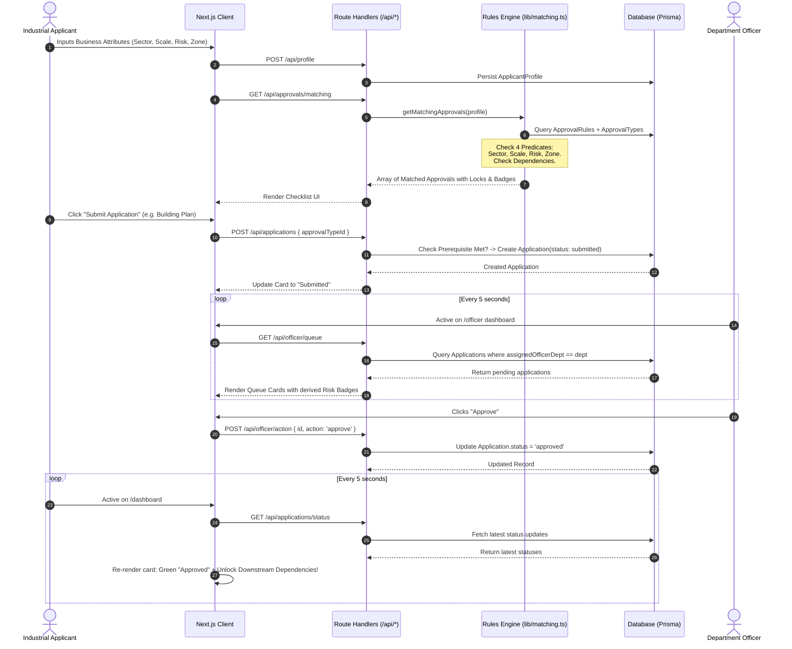

# API Reference, Data Flow & Domain Logic

This document details the REST API endpoints, the algorithmic data processing flow (**Input -> Process -> Output**), and the mathematical/logical formulation of the matching and risk rules.

---

## 1. End-to-End Data Flow Architecture

The platform operates on a transparent, auditable pipeline across all user and officer operations.



---

## 2. Input -> Process -> Output Specifications

### A. Approval Checklist Generation

| Phase | Description & Details |
| :--- | :--- |
| **INPUT** | `ApplicantProfile`: `{ sector, scale, locationDistrict, inNotifiedIndustrialZone, riskCategory, stage }` |
| **PROCESS** | 1. Query all `ApprovalRule` records with eager joins on `approvalType` and `dependsOn`.<br/>2. Evaluate deterministic matching predicate for each rule:<br/>$$\text{Match}(R, P) = (R.\text{sector} \in \{\text{null}, P.\text{sector}\}) \land (R.\text{scale} \in \{\text{null}, P.\text{scale}\}) \land (R.\text{risk} \in \{\text{null}, P.\text{risk}\}) \land (R.\text{zone} \in \{\text{null}, P.\text{zone}\})$$<br/>3. Group and deduplicate rules by `approvalTypeId`.<br/>4. Determine `isSelfCertifiable`: if any matching rule denies self-certification for this profile, flag as `false`.<br/>5. Cross-reference existing `Application` table to attach current status (`not_started`, `submitted`, `approved`, etc.).<br/>6. Check prerequisite dependency: if `approvalType.dependsOnId` exists, verify whether that prerequisite has an `Application` with `status === 'approved'`. |
| **OUTPUT** | Array of `MatchedApproval`: approval details, self-certification flag, dependency lock state, and active submission status. |

---

### B. Scheme Eligibility Matching

| Phase | Description & Details |
| :--- | :--- |
| **INPUT** | `ApplicantProfile`: Sector, Scale, District. |
| **PROCESS** | 1. Query `Scheme` catalog.<br/>2. Apply conjunction filter on non-null eligibility criteria.<br/>3. Formulate transparent rationale string explaining *why* the enterprise qualifies (e.g., *"You qualify because you're a Small-scale enterprise in the Manufacturing sector"*). |
| **OUTPUT** | Array of `MatchedScheme`: scheme details, subsidy amount, official source URL, and custom eligibility rationale. |

---

### C. Risk Tier Derivation

| Phase | Description & Details |
| :--- | :--- |
| **INPUT** | `riskCategory` from CPCB / MPCB classification (`green`, `white`, `orange`, `red`). |
| **PROCESS** | Pure deterministic function mapping: |
| | - `green` \| `white` $\rightarrow$ **Low Risk** (Green styling) |
| | - `orange` $\rightarrow$ **Medium Risk** (Amber styling) |
| | - `red` $\rightarrow$ **High Risk** (Red styling) |
| **OUTPUT** | `RiskBadge`: Risk level label, color classes, and UI icon indicator. |

---

## 3. Comprehensive REST API Reference

All routes are implemented under `app/api/*` using Next.js App Router Route Handlers.

### Authentication & Session

#### `POST /api/auth/send-otp`
Generates a mock 6-digit one-time password and prints it to the server console.
- **Request Body**:
  ```json
  { "identifier": "applicant@demo.com" }
  ```
- **Response (200 OK)**:
  ```json
  { "success": true, "message": "OTP sent successfully. Check the server console for the OTP code." }
  ```

#### `POST /api/auth/verify-otp`
Validates the OTP, provisions a `User` record if new, signs a JWT, and sets an `httpOnly` session cookie.
- **Request Body**:
  ```json
  { "identifier": "applicant@demo.com", "code": "817483", "name": "Shree Enterprises" }
  ```
- **Response (200 OK)**:
  ```json
  {
    "success": true,
    "user": { "id": "cmtt...", "name": "Shree Enterprises", "email": "applicant@demo.com", "role": "applicant" },
    "hasProfile": false
  }
  ```

#### `GET /api/auth/me`
Fetches current session user information from the HTTP-only cookie.
- **Response (200 OK)**: User object, role, officer department, and profile existence flag.
- **Response (401 Unauthorized)**: When unauthenticated.

#### `POST /api/auth/logout`
Clears the session cookie.
- **Response (200 OK)**: `{ "success": true }`

---

### Profile Management

#### `GET /api/profile`
Retrieves the logged-in applicant's business profile.
- **Response (200 OK)**: `{ "profile": { "sector": "manufacturing", "scale": "small", ... } }`

#### `POST /api/profile`
Submits the applicant onboarding questionnaire.
- **Request Body**:
  ```json
  {
    "name": "Mahalaxmi Engineering",
    "sector": "manufacturing",
    "scale": "small",
    "locationDistrict": "Pune",
    "inNotifiedIndustrialZone": true,
    "riskCategory": "orange",
    "stage": "new_unit"
  }
  ```
- **Response (201 Created)**: Created profile object.

---

### Approvals & Schemes Engine

#### `GET /api/approvals/matching`
Executes rule matching against the caller's profile and returns required approvals.
- **Response (200 OK)**:
  ```json
  {
    "approvals": [
      {
        "approvalType": {
          "id": "app_bld_01",
          "name": "Building Plan Approval",
          "department": "municipal_corp",
          "description": "Approval of factory construction plans..."
        },
        "isSelfCertifiable": false,
        "dependsOnName": null,
        "application": null
      }
    ]
  }
  ```

#### `GET /api/schemes/matching`
Returns government subsidy schemes matched against the applicant profile.
- **Response (200 OK)**: Matched schemes with generated rationale strings.

---

### Applications Lifecycle

#### `GET /api/applications`
Returns all historical applications submitted by the logged-in applicant.

#### `POST /api/applications`
Submits an approval application. Validates that prerequisite approvals have been completed first.
- **Request Body**:
  ```json
  { "approvalTypeId": "app_bld_01" }
  ```
- **Response (201 Created)**: Created application with status `submitted`.
- **Response (422 Unprocessable)**: If prerequisite approval is not approved yet.

#### `GET /api/applications/status`
*High-efficiency polling endpoint* used by the applicant dashboard to refresh card states every 5 seconds.
- **Response (200 OK)**:
  ```json
  {
    "applications": [
      {
        "id": "cmtt...",
        "approvalTypeId": "app_bld_01",
        "status": "approved",
        "updatedAt": "2026-09-09T06:05:00.000Z"
      }
    ]
  }
  ```

---

### Officer Queue & Action

#### `GET /api/officer/queue`
Returns all pending submissions assigned to the authenticated officer's department.
- **Response (200 OK)**: Applications array including applicant contact info, profile attributes, and approval details.
- **Response (403 Forbidden)**: If user role is not `officer`.

#### `POST /api/officer/action`
Updates application status based on officer decision.
- **Request Body**:
  ```json
  {
    "applicationId": "cmtt...",
    "action": "approve" // "approve" | "reject" | "request_info"
  }
  ```
- **Response (200 OK)**: Updated application record.
