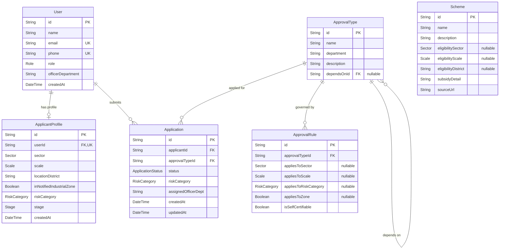

# Database Architecture, Schema & Seed Specifications

This document specifies the database structure, entity-relationship models, enum definitions, constraints, and pre-seeded domain records for the **Screwless** platform.

---

## 1. Entity-Relationship Diagram (ERD)



---

## 2. Table Specifications & Data Dictionaries

### 2.1 `User`
Stores authenticated entities (both Industrial Applicants and Department Officers).

| Field | Type | Attributes | Description |
| :--- | :--- | :--- | :--- |
| `id` | `String` | `@id @default(cuid())` | Unique entity identifier |
| `name` | `String?` | Nullable | Full name or company representative name |
| `email` | `String?` | `@unique` | Contact email address |
| `phone` | `String?` | `@unique` | Contact phone number |
| `role` | `Role` | `@default(applicant)` | User authorization tier (`applicant` or `officer`) |
| `officerDepartment` | `String?` | Nullable | Government department code (e.g., `fire_dept`, `mpcb`, `dish`) |
| `createdAt` | `DateTime` | `@default(now())` | Registration timestamp |

### 2.2 `ApplicantProfile`
Stores the regulatory characteristics of an applicant's industrial enterprise.

| Field | Type | Attributes | Description |
| :--- | :--- | :--- | :--- |
| `id` | `String` | `@id @default(cuid())` | Primary key |
| `userId` | `String` | `@unique`, FK -> `User.id` | Associated user reference (1-to-1) |
| `sector` | `Sector` | Required | Industry sector (`manufacturing`, `chemical`, `pharma`, etc.) |
| `scale` | `Scale` | Required | Enterprise size category (`micro`, `small`, `medium`, `large`) |
| `locationDistrict` | `String` | Required | District in Maharashtra (e.g., Pune, Nashik, Thane) |
| `inNotifiedIndustrialZone` | `Boolean` | Required | True if situated in MIDC / notified industrial area |
| `riskCategory` | `RiskCategory`| Required | Pollution classification (`green`, `white`, `orange`, `red`) |
| `stage` | `Stage` | Required | Life cycle phase (`new_unit`, `expansion`, `operational`) |
| `createdAt` | `DateTime` | `@default(now())` | Creation timestamp |

### 2.3 `ApprovalType`
Master catalog of statutory clearances, licenses, and permits required in Maharashtra.

| Field | Type | Attributes | Description |
| :--- | :--- | :--- | :--- |
| `id` | `String` | `@id @default(cuid())` | Primary key |
| `name` | `String` | Required | Official title of the clearance |
| `department` | `String` | Required | Authority code (`municipal_corp`, `mpcb`, `fire_dept`, etc.) |
| `description` | `String` | Required | Statutory context, regulatory act, and applicability |
| `dependsOnId` | `String?` | FK -> `ApprovalType.id` | Self-referential FK defining prerequisite approval |

### 2.4 `ApprovalRule`
Rules matrix defining which industrial attributes trigger an approval requirement.

| Field | Type | Attributes | Description |
| :--- | :--- | :--- | :--- |
| `id` | `String` | `@id @default(cuid())` | Primary key |
| `approvalTypeId` | `String` | FK -> `ApprovalType.id` | Clearance type associated with rule |
| `appliesToSector` | `Sector?` | Nullable | Null indicates "Applicable to ALL sectors" |
| `appliesToScale` | `Scale?` | Nullable | Null indicates "Applicable to ALL scales" |
| `appliesToRiskCategory`| `RiskCategory?`| Nullable | Null indicates "Applicable to ALL risk classes" |
| `appliesToZone` | `Boolean?` | Nullable | Null indicates "Applies regardless of zone" |
| `isSelfCertifiable` | `Boolean` | `@default(false)` | Reflects Maharashtra's self-certification policy |

### 2.5 `Application`
Represents an instance of an approval requested by an applicant and reviewed by an officer.

| Field | Type | Attributes | Description |
| :--- | :--- | :--- | :--- |
| `id` | `String` | `@id @default(cuid())` | Primary key |
| `applicantId` | `String` | FK -> `User.id` | The industrial applicant |
| `approvalTypeId` | `String` | FK -> `ApprovalType.id` | Clearance being applied for |
| `status` | `ApplicationStatus`| `@default(not_started)` | Status lifecycle state |
| `riskCategory` | `RiskCategory`| Required | Snapshot of pollution category at submission time |
| `assignedOfficerDept`| `String?` | Indexed | Route target for officer queue routing |
| `createdAt` / `updatedAt`| `DateTime`| Timestamps | Audit tracking |

### 2.6 `Scheme`
Government industrial incentives, capital grants, and duty exemptions.

| Field | Type | Attributes | Description |
| :--- | :--- | :--- | :--- |
| `id` | `String` | `@id @default(cuid())` | Primary key |
| `name` | `String` | Required | Scheme title under Maharashtra Industrial Policy |
| `description` | `String` | Required | Purpose of incentive |
| `eligibilitySector` | `Sector?` | Nullable | Sector restriction (null = all) |
| `eligibilityScale` | `Scale?` | Nullable | Scale restriction (null = all) |
| `eligibilityDistrict`| `String?` | Nullable | Regional restriction (e.g., C, D, D+ talukas/districts) |
| `subsidyDetail` | `String` | Required | Quantum of subsidy or interest subvention percentage |
| `sourceUrl` | `String` | Required | Official portal reference (e.g. MAITRI portal) |

---

## 3. Enumerations & Value Domains

```prisma
enum Role {
  applicant
  officer
}

enum Sector {
  manufacturing
  chemical
  food_processing
  textiles
  pharma
  other
}

enum Scale {
  micro      // Investment up to ₹1 Cr
  small      // Investment up to ₹10 Cr
  medium     // Investment up to ₹50 Cr
  large      // Investment above ₹50 Cr
}

enum RiskCategory {
  green      // Non-polluting
  white      // Least polluting
  orange     // Moderately polluting
  red        // Heavily polluting
}

enum Stage {
  new_unit
  expansion
  operational
}

enum ApplicationStatus {
  not_started
  submitted
  in_review
  info_requested
  approved
  rejected
}
```

---

## 4. Pre-Seeded Catalog Summary

### Approval Types (10 Master Entries)
1. **Land Allotment / MIDC Plot** (`midc`)
2. **Building Plan Approval** (`municipal_corp`)
3. **Factory License** (`dish`) — *Depends on Building Plan Approval*
4. **Fire NOC** (`fire_dept`) — *Depends on Building Plan Approval*
5. **Pollution NOC / Consent to Establish** (`mpcb`)
6. **Electricity Connection (HT/LT)** (`msedcl`)
7. **Labour Registration** (`labour_dept`)
8. **Water NOC / Connection** (`water_resources`)
9. **Shops & Establishment Registration** (`municipal_corp`)
10. **GST Registration** (`tax_dept`)

### Approval Rules (32 Pre-Seeded Logic Rows)
- **Self-Certification Policy Alignment**: Under Maharashtra Ease of Doing Business reforms, 20+ clearances permit self-certification. The rules table reflects this by marking `isSelfCertifiable: true` on Green and White categories for Building Plans, Fire NOCs, Factory Licenses, Labour Registrations, and Shop Registrations. Red and Orange categories strictly require inspection and verification (`isSelfCertifiable: false`).

### Government Schemes (8 Pre-Seeded Policies)
1. *Capital Investment Subsidy (Micro)*
2. *Capital Investment Subsidy (Small)*
3. *Interest Subsidy Scheme (Manufacturing)*
4. *Electricity Duty Exemption (All Sectors)*
5. *Stamp Duty Exemption (Nashik & C/D/D+ Districts)*
6. *Technology Upgradation Scheme (Small Scale)*
7. *Quality Certification Reimbursement (Food Processing)*
8. *Employment Generation Subsidy (Medium Scale)*
