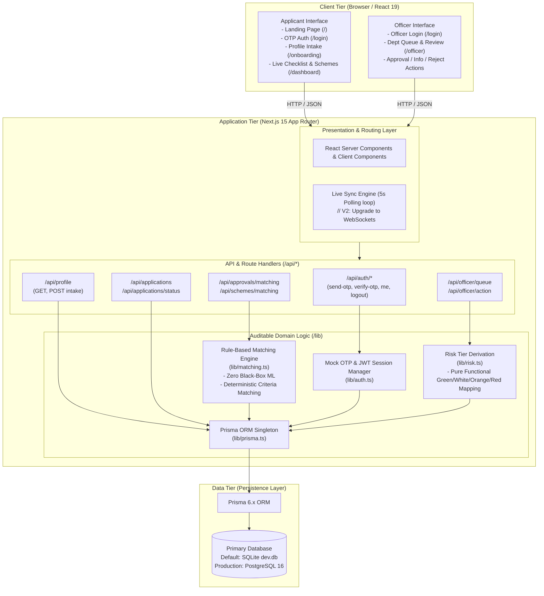

# System Architecture, Tech Stack & Infrastructure

This document outlines the architectural blueprint, technology decisions, component interactions, and infrastructure specifications for the **Screwless** Industrial Approvals & Compliance Streamlining Platform.

---

## 1. System Architecture Diagram



---

## 2. Architectural Design Principles

1. **Deterministic & Explainable Compliance Logic**:
   - **No Black-Box AI/ML**: In legal compliance and government statutory approvals, decisions require explicit regulatory justification. All checklist generation and scheme eligibility use transparent, auditable rules tables.
2. **Unified Full-Stack Repository**:
   - Next.js 15 App Router serves both frontend views and backend REST API route handlers, avoiding microservice synchronization overhead for hackathon speed and local portability.
3. **Stateless Session Management**:
   - Authentication relies on signed JSON Web Tokens (JWT) stored in secure, `httpOnly`, `SameSite=Lax` cookies, protecting against XSS attacks while eliminating server-side session stores.
4. **Dual-Dashboard Real-Time Synchronization**:
   - State mutations by department officers propagate to the applicant's checklist card within a sub-5-second window without needing manual page reloads.

---

## 3. Tech Stack Breakdown

| Layer | Technology | Version | Purpose & Rationale |
| :--- | :--- | :--- | :--- |
| **Frontend Framework** | **Next.js (App Router)** | `15.x` | Modern server-side rendering, client components, and integrated routing. |
| **UI Library** | **React** | `19.x` | Declarative UI, component lifecycle, reactive client hooks (`useState`, `useEffect`, `useCallback`). |
| **Language** | **TypeScript** | `5.x` | End-to-end type safety across database entities, API payloads, and UI props. |
| **Styling** | **Tailwind CSS** | `4.x` | Utility-first styling with CSS `@theme` variables for risk badges and status indicators. |
| **ORM** | **Prisma** | `6.x` | Strongly-typed database client, declarative schema definitions, and automated migrations. |
| **Database** | **SQLite / PostgreSQL** | `v3` / `v16` | SQLite default for zero-setup demo portability; fully swappable to PostgreSQL. |
| **Authentication** | **Custom JWT + Mock OTP** | `jsonwebtoken ^9` | Zero-dependency, zero-cost authentication flow designed for local evaluation. |
| **Containerization** | **Docker & Compose** | `v3.8 spec` | Portable container configuration for running PostgreSQL and Next.js standalone. |

---

## 4. Required Resources (Free, Open-Source & Self-Contained)

The entire project operates **100% locally and completely free of cost** with no external paid APIs or cloud dependencies:

| Resource Type | Resource / Tool | Cost | License | Purpose in Project |
| :--- | :--- | :--- | :--- | :--- |
| **Runtime** | Node.js | Free | Open-Source (MIT) | Executes JavaScript/TypeScript runtime. |
| **CSS Engine** | Tailwind CSS & `@tailwindcss/postcss` | Free | Open-Source (MIT) | Generates responsive styling and design system. |
| **ORM & DB Engine** | Prisma Client & CLI | Free | Open-Source (Apache 2.0) | Schema management, type generation, database querying. |
| **Database Engine** | SQLite (Embedded) | Free | Public Domain | Serverless, zero-configuration local database. |
| **Containerization** | Docker Engine & Alpine Linux | Free | Open-Source (Apache/MIT) | Local PostgreSQL isolation (optional deployment mode). |
| **OTP Delivery** | Standard Terminal Console Output | Free | Internal | Mock OTP dispatch via formatted CLI logging (replaces paid Twilio/SMS services). |
| **Typography & Icons** | System Font Stack & Native Unicode/Emoji | Free | Native OS | Zero-network dependency visual cues and badges. |

---

## 5. Deployment Topology

```
┌──────────────────────────────────────────────────────────┐
│                      Host Laptop                         │
│                                                          │
│  ┌────────────────────────┐    ┌──────────────────────┐  │
│  │    Web Browser Tab 1   │    │  Web Browser Tab 2   │  │
│  │   (Applicant Session)  │    │   (Officer Session)  │  │
│  └───────────┬────────────┘    └──────────┬───────────┘  │
│              │ :3000                      │ :3000        │
│  ┌───────────┴────────────────────────────┴───────────┐  │
│  │           Node.js Process (Next.js 15)             │  │
│  │           • React SSR & Client Bundles             │  │
│  │           • API Handlers & Rules Engine            │  │
│  │           • Prisma Client ORM                      │  │
│  └───────────────────────┬────────────────────────────┘  │
│                          │ file I/O or TCP 5432          │
│  ┌───────────────────────┴────────────────────────────┐  │
│  │      Local SQLite Database File (./dev.db)         │  │
│  │      (or PostgreSQL Container via Docker)          │  │
│  └────────────────────────────────────────────────────┘  │
└──────────────────────────────────────────────────────────┘
```
